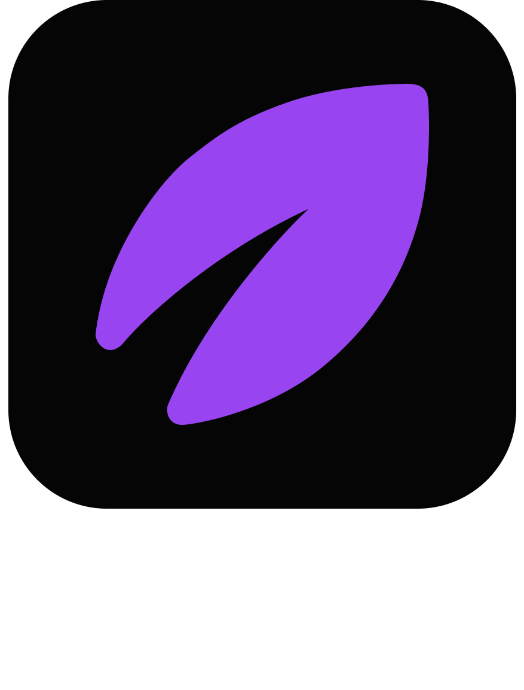

<div align="center">
  

[](https://github.com/coffeein-dev/voleeo-api/actions/workflows/ci.yml)
[](LICENSE)

</div>

An **AI-native local toolkit with an MCP bridge**. 

Voleeo is an open-source, AI-native desktop API client for HTTP, HTTPS, and WebSocket — built so a
human developer and an AI agent (over [MCP](https://modelcontextprotocol.io)) drive the same workspace.

With Voleeo you can:

- **Hand your workspace to an AI agent** — any MCP client drives the exact requests, environments, and cookie jars you see on screen.
- **Send and dissect requests** over HTTP/HTTPS and WebSocket, with a phase-by-phase timeline (DNS, redirects, chunks, errors) and in-flight cancellation.
- **Tame huge responses** — stream and window 20MB+ bodies, filter with JSONPath, fold code, and search them server-side.
- **Template anything** — `{{ ENV_VAR }}`, `{{ uuid.v4() }}`, and plugin functions resolve at send time and render as chips.
- **Version collections in Git** — review, commit, push/pull, branch, and resolve conflicts, with per-file history and revert.
- **Keep secrets encrypted at rest** — per-workspace AES-256-GCM with keys in the OS keychain.
- **Extend it with plugins** — contribute base16 themes, template functions, and request actions.

> Status: pre-release. Formats and APIs may change without migration shims.

## Build from source

Requires [Bun](https://bun.sh), a Rust toolchain, and **Node 24.15.0** (pinned in `.nvmrc`).

```bash
nvm use            # activate Node 24.15.0
bun install        # install JS deps
bun run dev        # Tauri + Vite with HMR (dev window)
bun run build      # production build
```

Tauri also needs your platform's system webview/build dependencies — see the
[Tauri v2 prerequisites](https://v2.tauri.app/start/prerequisites/).

Useful checks:

```bash
bun run typecheck
bun run lint               # biome
cargo check --workspace
cargo clippy --workspace
cargo test --workspace
```

## MCP quickstart

Voleeo is an MCP **server**. Enable the bridge in the app, then point your MCP client at the bundled
`voleeo-mcp-bridge` sidecar — the app's `get_app_info` returns its on-disk path to wire into your
client config, and the in-app MCP modal shows per-client setup steps.

## Contributing

Contributions are welcome — see [CONTRIBUTING.md](CONTRIBUTING.md) for dev setup, the quality gates,
and the architecture rules in [AGENTS.md](AGENTS.md). To report a security issue, see
[SECURITY.md](SECURITY.md).

## License

[MIT](LICENSE) © Voleeo
